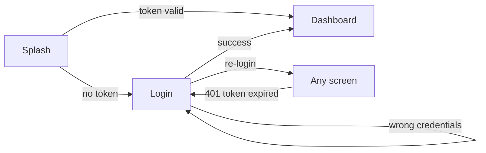
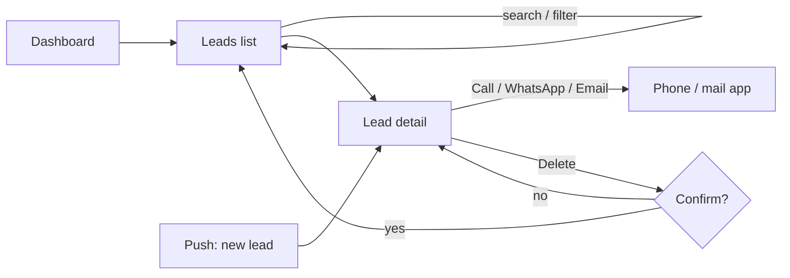
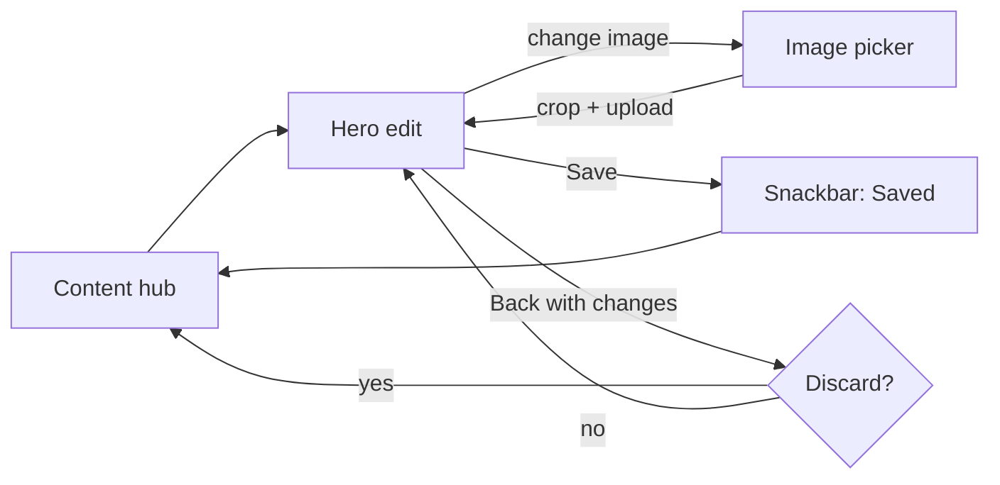
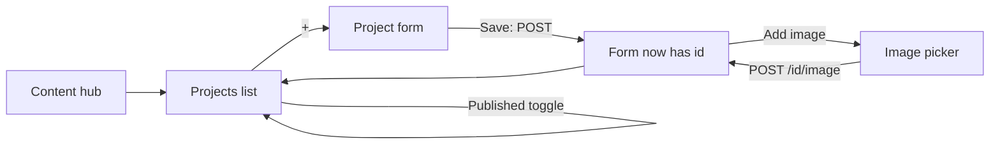
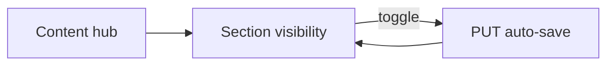

# BuildPro Admin – Flutter App: Screen List & User Flows (v0.1 draft)

Based on the existing Spring Boot backend (`com.example.buildpro`).

## Navigation
Bottom tab bar with 4 tabs: **Dashboard · Leads · Content · Settings**

## Screen list

### Auth
| # | Screen | Contents | API |
|---|---|---|---|
| 1 | Splash | Logo, checks for a saved token | — |
| 2 | Login | Username, password (show/hide), Login button, error message | new token login endpoint (to add) |

### Dashboard
| # | Screen | Contents | API |
|---|---|---|---|
| 3 | Dashboard | Stat cards: Total / Today / This week; latest 5 leads; quick actions (View leads, Edit hero, Add project) | `GET /api/leads/stats`, `GET /api/leads?size=5` |

### Leads
| # | Screen | Contents | API |
|---|---|---|---|
| 4 | Leads list | Search by name, filter chip, infinite scroll (20 per page), pull to refresh, swipe to delete | `GET /api/leads?name=&from=&to=&page=` |
| 5 | Lead filter (bottom sheet) | From / To date pickers, Clear, Apply | — |
| 6 | Lead detail | Name, email, phone, message, received date; Call, WhatsApp/SMS, Email buttons; Delete | `GET /api/leads/{id}`, `DELETE /api/leads/{id}` |

### Content
| # | Screen | Contents | API |
|---|---|---|---|
| 7 | Content hub | Rows: Hero, About, Services, Stats, Projects, Sample plans, Testimonials, Company info, Section visibility | — |
| 8 | Hero edit | Headline, subheading, CTA text, background image | `/api/hero-section` (+ `/{id}/image`) |
| 9 | About edit | Heading, body, image | `/api/about-section` (+ `/{id}/image`) |
| 10 | Item list (one shared template) | Services / Stats / Projects / Sample plans / Testimonials: drag to reorder, Published toggle, + button | `GET` list, `PUT /{id}` |
| 11a | Service form | Title, description, published | `/api/services` |
| 11b | Stat form | Label, target value, published | `/api/stats` |
| 11c | Project form | Title, image, published | `/api/projects` (+ image) |
| 11d | Sample plan form | Plan type, title, description, image, video URL, published | `/api/sample-plans` (+ image) |
| 11e | Testimonial form | Client name, message, rating (1–5 stars), published | `/api/testimonials` |
| 12 | Image picker (bottom sheet) | Camera / Gallery → crop → upload progress | `POST /{id}/image` |
| 13 | Company info edit | Company name, address, phone, email | `/api/company-info` |
| 14 | Section visibility | 8 toggles: Home, About, Services, Stats, Projects, Sample plans, Testimonials, Contact | `/api/site-sections` |

### Settings
| # | Screen | Contents |
|---|---|---|
| 15 | Settings | Signed-in user, notifications toggle, server environment (dev/prod), app version, Log out |

### Shared states (design once, reuse everywhere)
Loading skeleton · Empty state · Error / offline with Retry · Session expired · Unsaved-changes dialog · Delete confirmation · Success snackbar

## User flows

### Flow A – Login and session

### Flow B – Triage a lead

### Flow C – Edit hero or about section

### Flow D – Add a project / sample plan

Note: the image upload needs the item's id, so the item is saved first and the image is added afterwards.

### Flow E – Hide or show a site section

## Backend changes these screens need
1. **Token login (JWT) for the app**: current setup uses form login + session + CSRF cookie.
2. **Push notifications for new leads** (Flow B): register the device token, then send from `LeadNotificationService` (Firebase Cloud Messaging).
3. *(Optional)* **Lead status / notes** (New → Contacted → Closed): `Lead` has no status field today.
4. *(Optional)* **Bulk reorder endpoint**: reordering currently means one `PUT` per item.
